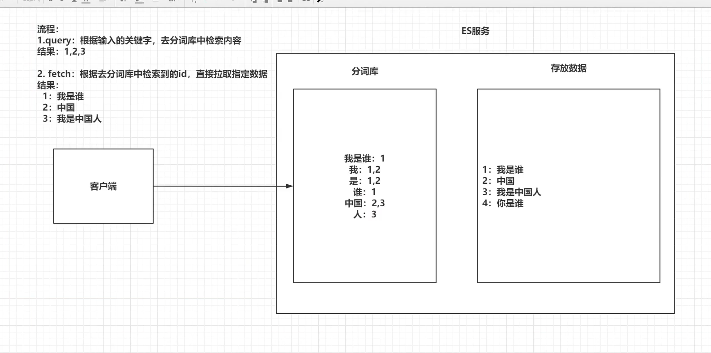
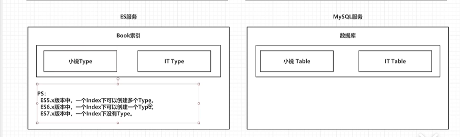
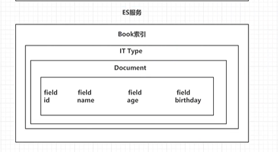
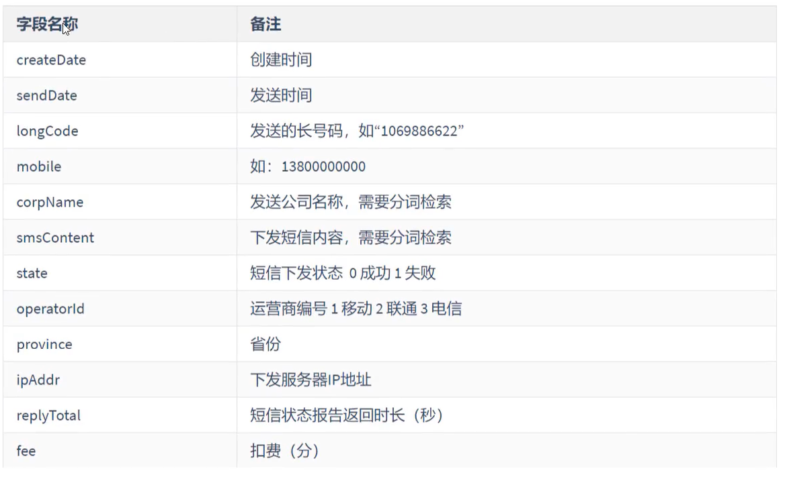

# 1.1ES简介

ES是使用java 语言并且基于lucence编写的搜索引擎框架，他提供了分布式的全文搜索功能，提供了一个统一的基于restful风格的web 接口。

lucence:一个搜索引擎底层

分布式：突出ES的横向扩展能力

全文检索：将一段词语进行分词，并将分出的词语统一的放在一个分词库中，再搜索时，根据关键字取分词库中检索，找到匹配的内容（倒排索引）。

restful风格的web 接口：只要发送一个http请求，并且根据请求方式的不同，携带参数的不同，执行相应的功能。

应用广泛：WIKI, github,Gold man

# 1.2ES的由来

```
回忆时光**

许多年前，一个刚结婚的名叫 Shay Banon 的失业开发者，跟着他的妻子去了伦敦，他的妻子在那里学习厨师。 在寻找一个赚钱的工作的时候，为了给他的妻子做一个食谱搜索引擎，他开始使用 Lucene 的一个早期版本。

直接使用 Lucene 是很难的，因此 Shay 开始做一个抽象层，Java 开发者使用它可以很简单的给他们的程序添加搜索功能。 他发布了他的第一个开源项目 Compass。

后来 Shay 获得了一份工作，主要是高性能，分布式环境下的内存数据网格。这个对于高性能，实时，分布式搜索引擎的需求尤为突出， 他决定重写 Compass，把它变为一个独立的服务并取名 Elasticsearch。

第一个公开版本在2010年2月发布，从此以后，Elasticsearch 已经成为了 Github 上最活跃的项目之一，他拥有超过300名 contributors(目前736名 contributors )。 一家公司已经开始围绕 Elasticsearch 提供商业服务，并开发新的特性，但是，Elasticsearch 将永远开源并对所有人可用。

据说，Shay 的妻子还在等着她的食谱搜索引擎…
```

# 1.3ES和solr

1.solr 查询死数据，速度比es快。但是数据如果是改变的，solr查询速度会降低很多，ES的查询速度没有明显的改变

2.solr搭建集群 依赖ZK，ES本身就支持集群搭建

3.最开始solr 的社区很火爆，针对国内文档 少，ES出现后，国内社区火爆程度 上升，，ES的文档非常健全

4.ES对云计算和大数据支持很好

# 1.4倒排索引



1.将存放的数据以一定的方式进行分词，并将分词的内容存放到一个单独的分词库中。

2.当用户取查询数据时，会将用户的查询关键字进行分词，然后去分词库中匹配内容，最终得到数据的id标识

3.根据id标识去存放数据的位置拉去指定数据

# 2 安装

##### 2.1 elasticsearch 安装

http://hub.daocloud.io/    docker 镜像工厂地址

```yml
version: "3.1"
services:
  elasticsearch: 
    image: daocloud.io/library/elasticsearch:6.5.4
    restart: always
    container_name: elasticsearch
    ports: 
      - 9200:9200
      - 9300:9300
   kibana:
    image: daocloud.io/library/kibana:6.5.4
    restart: always
    container_name: kibana
    ports: 
      - 9200:9200
    environment:
      - elasticsearch_url=ip:9200
    depends_on:
      - elasticseatch
   
```

或者本地下载

2.2

https://github.com/medcl/elasticsearch-analysis-ik/archive/v6.8.10.zip

```
官方给的安装的办法
./bin/elasticsearch-plugin install https://github.com/medcl/elasticsearch-analysis-ik/releases/download/v6.3.0/elasticsearch-analysis-ik-6.3.0.zip
```

本地自己安装

```
https://github.com/medcl/elasticsearch-analysis-ik/archive/v6.8.10.zip 
下载好后，
执行 mvn clean package  打包（注意pom文件中的es的版本，如果和自己的es的版本不一致，手动改下）
elasticsearch-analysis-ik-6.8.10\target\releases  中压缩包的内容copy到 elasticsearch-6.8.10\plugins\ik 下
```

kibana 主要用到 Dev Tools   和 Management

```
POST _analyze
{
  "analyzer": "ik_max_word",
  "text":"我是中国人"
}
```

# 3 es的基本操作

##### 3.1 es的结构

###### 3.1.1索引indx，分片，备份

```
ES服务中会创建多个索引
每个缩影默认被分成5个分片
每个分片存在至少一个备份分片
备份分片 不会帮助检索数据（当ES检索压力特别大的时候才，备份分片才会帮助检索数据）
备份的分片必须放在不同的服务器中
```


###### 3.1.2 类型type

```
一个索引下可以创建多个类型
PS:版本不同,类型的创建也不同
```



###### 3.1.3 文档document

```
一个类型下可以有多个文档，这个文档就相当于mysql表中的多行数据
```


3.1.4 属性field

```
一个文档中可以包含多个属性，类似于mysql 表中的一行数据有多个列
```



##### 3.2操作ES的restful语法

```
GET请求：
	http://ip:port/index :查询索引信息
	http://ip:port/index/type/doc_id :查询指定的文档信息
POST请求：
    http://ip:port/index/type/_search: 查询文档，可以在请求体中添加json字符串来代表查询条件
    http://ip:port/index/type/doc_id/_update: 修改文档，在请求体中添加json字符串来代表修改的信息
PUT请求：
    http://ip:port/index : 创建一个索引，需要在请求体中指定索引的信息
    http://ip:port/index/type/_mappings:代表创建索引时，指定索引文档存储属性的信息
DELETE 请求：
    http://ip:port/index： 删除跑路
    http://ip:port/index/type/doc_id:  删除指定的文档
```

##### 3.3 索引的操作

###### 3.3.1 创建一个索引

```json
#创建一个索引
#number_of_shards  分片
#number_of_replicas 备份
PUT /person
{
  "settings": {
    "number_of_shards": 5, 
    "number_of_replicas": 1
  }
}
```

###### 3.3.2 查看一个索引

```json
1.management

2.
#查看索引信息
GET /person
```

###### 3.3.3 删除 索引

```json
1.management

2.
#删除索引
DELETE /person
```

##### 3.4 ES中Field可以指定的类型

https://www.elastic.co/guide/en/elasticsearch/reference/6.8/mapping-types.html  官方 文档

```json
字符串类型:
  text: 一般用于全文检索，将当前field 进行分词
  keyword:当前field  不会进行分词
数值类型：
  long:
  Intger:
  short:
  byte:
  double:
  float:
  half_float: 精度比float 小一半
  scaled_float:根据一个long 和scaled 来表达一个浮点型 long-345, -scaled 100 ->3.45
时间类型：
  date类型,根据时间类型指定具体的格式
    PUT my_index
    {
      "mappings": {
        "_doc": {
          "properties": {
            "date": {
              "type":   "date",
              "format": "yyyy-MM-dd HH:mm:ss||yyyy-MM-dd||epoch_millis"
            }
          }
        }
      }
    }
布尔类型：
  boolean 类型，表达true 和false
二进制类型：
  binary类型暂时支持Base64编码的字符串
范围类型：
  integer_range：
  float_range：
  long_range：赋值时，无需指定具体的内容，只需存储一个范围即可，gte,lte,gt,lt,
  double_range：
  date_range：
  ip_range：

    PUT range_index
    {
      "settings": {
        "number_of_shards": 2
      },
      "mappings": {
        "_doc": {
          "properties": {
            "expected_attendees": {
              "type": "integer_range"
            },
            "time_frame": {
              "type": "date_range", 
              "format": "yyyy-MM-dd HH:mm:ss||yyyy-MM-dd||epoch_millis"
            }
          }
        }
      }
    }

    PUT range_index/_doc/1?refresh
    {
      "expected_attendees" : { 
        "gte" : 10,
        "lte" : 20
      },
      "time_frame" : { 
        "gte" : "2015-10-31 12:00:00", 
        "lte" : "2015-11-01"
      }
    }
经纬度类型：
  geo_point:用来存储经纬度
IP类型：
  ip:可以存储IPV4 和IPV6
其他的数据类型，参考官网
```

##### 3.5 创建索引并指定数据结构

```json
#创建索引，指定数据类型
PUT /book
{
  "settings": {
    #分片数
    "number_of_shards": 5,
    #备份数
    "number_of_replicas": 1
  },
    #指定数据类型
 "mappings": {
    #类型 Type
   "novel":{
    #文档存储的field
     "properties":{
       #field属性名
       "name":{
         #类型
         "type":"text",
         #指定分词器
         "analyzer":"ik_max_word",
         #指定当前的field可以被作为查询的条件
         "index":true,
         #是否需要额外存储
         "store":false
       },
       "author":{
         "type":"keyword"
       },
       "count":{
         "type":"long"
       },
       "on-sale":{
         "type":"date",
           #指定时间类型的格式化方式
         "format": "yyyy-MM-dd HH:mm:ss||yyyy-MM-dd||epoch_millis"
       },
        "descr":{
          "type":"text",
          "analyzer":"ik_max_word"
       }
     }
   }
 }
}
```

##### 3.6 文档操作

```
文档在ES服务中的唯一标识， _indx ,_type,_id  三个内容为组合，锁定一个文档，操作时添加还时修改操作，
```


###### 3.6.1 新建文档

```json
自动生成id
#添加文档，自动生成id
POST /book/novel
{
  "name":"盘龙",
  "author":"我吃西红柿",
  "count":100000,
  "on-sale":"2001-01-01",
  "descr":"大小的血睛鬃毛狮，力大无穷的紫睛金毛猿，毁天灭地的九头蛇皇，携带着毁灭雷电的恐怖雷龙……这里无奇不有，这是一个广博的魔幻世界。强者可以站在黑色巨龙的头顶遨游天际，恐怖的魔法可以焚烧江河，可以毁灭城池，可以夷平山岳……"
}

#添加文档,手动指定id
PUT /book/novel/1
{
  "name":"红楼梦",
  "author":"曹雪芹",
  "count":10000000,
  "on-sale":"2501-01-01",
  "descr":"中国古代章回体长篇小说，中国古典四大名著之一，一般认为是清代作家曹雪芹所著。小说以贾、史、王、薛四大家族的兴衰为背景，以富贵公子贾宝玉为视角，以贾宝玉与林黛玉、薛宝钗的爱情婚姻悲剧为主线，描绘了一批举止见识出于须眉之上的闺阁佳人的人生百态，展现了真正的人性美和悲剧美"
}
```


###### 3.6.2 修改文档

1.覆盖式修改

```
#添加文档,手动指定id
PUT /book/novel/1
{
  "name":"红楼梦",
  "author":"曹雪芹",
  "count":1000444,
  "on-sale":"2501-01-01",
  "descr":"中国古代章回体长篇小说，中国古典四大名著之一，一般认为是清代作家曹雪芹所著。小说以贾、史、王、薛四大家族的兴衰为背景，以富贵公子贾宝玉为视角，以贾宝玉与林黛玉、薛宝钗的爱情婚姻悲剧为主线，描绘了一批举止见识出于须眉之上的闺阁佳人的人生百态，展现了真正的人性美和悲剧美"
}
```

2.使用doc修改方式

```json
#修改文档，使用doc 方式
POST /book/novel/1/_update
{
  "doc":{
      #指定需要修改的field和对应的值
    "count":566666
  }
}
```


###### 3.6.3 删除文档

```json
#根据id删除文档
DELETE /book/novel/3mEnk3MBaSKoGN4T2olw 
```

# 4.java 操作ElasticSearch

##### 4.1 java 连接ES

```xml
创建maven工程
导入依赖
<!--        1.elasticsearch-->
        <dependency>
            <groupId>org.elasticsearch</groupId>
            <artifactId>elasticsearch</artifactId>
            <version>6.8.10</version>
        </dependency>
<!--        2.elasticsearch 高级API-->
        <dependency>
            <groupId>org.elasticsearch.client</groupId>
            <artifactId>elasticsearch-rest-high-level-client</artifactId>
            <version>6.8.10</version>
        </dependency>
<!--        3.junit-->
        <dependency>
            <groupId>junit</groupId>
            <artifactId>junit</artifactId>
            <version>4.12</version>
        </dependency>
<!--        4.lombok-->
        <dependency>
            <groupId>org.projectlombok</groupId>
            <artifactId>lombok</artifactId>
            <version>1.16.22</version>
        </dependency>
```

创建client链接

```java
package com.utils;

import org.apache.http.HttpHost;
import org.elasticsearch.client.RestClient;
import org.elasticsearch.client.RestClientBuilder;
import org.elasticsearch.client.RestHighLevelClient;

public class EsClient {

    public static RestHighLevelClient getClient(){
        //  创建 HttpHost
        HttpHost httpHost = new HttpHost("127.0.0.1",9200);

        // 创建 RestClientBuilder
        RestClientBuilder builder = RestClient.builder(httpHost);

        // 创建 RestHighLevelClient
        RestHighLevelClient client = new RestHighLevelClient(builder);

        return client;
    }
}
```

##### 4.2创建索引

```java
package com.test;

import com.utils.EsClient;
import org.elasticsearch.action.admin.indices.create.CreateIndexRequest;
import org.elasticsearch.action.admin.indices.create.CreateIndexResponse;
import org.elasticsearch.client.RequestOptions;
import org.elasticsearch.client.RestHighLevelClient;
import org.elasticsearch.common.settings.Settings;
import org.elasticsearch.common.xcontent.XContentBuilder;
import org.elasticsearch.common.xcontent.json.JsonXContent;
import org.junit.Test;

public class Demo2 {
    RestHighLevelClient client =  EsClient.getClient();
    String index = "person";
    String type="man";

    @Test
    public void createIndx() throws Exception{
        // 1.准备关于索引的setting
        Settings.Builder settings = Settings.builder()
                .put("number_of_shards", 2)
                .put("number_of_replicas", 1);

        // 2.准备关于索引的mapping
        XContentBuilder mappings = JsonXContent.contentBuilder()
                .startObject()
                    .startObject("properties")
                        .startObject("name")
                            .field("type", "text")
                        .endObject()
                        .startObject("age")
                            .field("type", "integer")
                        .endObject()
                        .startObject("birthday")
                            .field("type", "date")
                            .field("format", "yyyy-MM-dd")
                        .endObject()
                    .endObject()
                .endObject();
        // 3.将settings和mappings 封装到到一个Request对象中
        CreateIndexRequest request = new CreateIndexRequest(index)
                .settings(settings)
                .mapping(type,mappings);
        // 4.使用client 去连接ES
        CreateIndexResponse response = client.indices().create(request, RequestOptions.DEFAULT);

        System.out.println("response:"+response.toString());
    }
}
```

##### 4.3 检查索引是否存在，删除索引

###### 4.3.1 检查索引存在

```java
package com.test;

import com.utils.EsClient;
import org.elasticsearch.action.admin.indices.create.CreateIndexRequest;
import org.elasticsearch.action.admin.indices.create.CreateIndexResponse;
import org.elasticsearch.client.RequestOptions;
import org.elasticsearch.client.RestHighLevelClient;
import org.elasticsearch.client.indices.GetIndexRequest;
import org.elasticsearch.common.settings.Settings;
import org.elasticsearch.common.xcontent.XContentBuilder;
import org.elasticsearch.common.xcontent.json.JsonXContent;
import org.junit.Test;

import java.io.IOException;

public class Demo2 {
    RestHighLevelClient client =  EsClient.getClient();
    String index = "person";
    String type="man";


    @Test
    public void existTest() throws IOException {

        //  1.准备request 对象
        GetIndexRequest request = new GetIndexRequest(index);

        // 2.通过client 去 操作
        boolean exists = client.indices().exists(request, RequestOptions.DEFAULT);
        // 3输出结果
        System.out.println(exists);
    }
}

```

###### 4.3.2 删除索引

```java
package com.test;

import com.utils.EsClient;
import org.elasticsearch.action.admin.indices.create.CreateIndexRequest;
import org.elasticsearch.action.admin.indices.create.CreateIndexResponse;
import org.elasticsearch.action.admin.indices.delete.DeleteIndexRequest;
import org.elasticsearch.action.support.master.AcknowledgedResponse;
import org.elasticsearch.client.RequestOptions;
import org.elasticsearch.client.RestHighLevelClient;
import org.elasticsearch.client.indices.GetIndexRequest;
import org.elasticsearch.common.settings.Settings;
import org.elasticsearch.common.xcontent.XContentBuilder;
import org.elasticsearch.common.xcontent.json.JsonXContent;
import org.junit.Test;

import java.io.IOException;

public class Demo2 {
    RestHighLevelClient client =  EsClient.getClient();
    String index = "person";
    String type="man";

    @Test
    public void testDelete() throws IOException {
        // 1.获取request

        DeleteIndexRequest request = new DeleteIndexRequest(index);

        //  2.使用client 操作request
        AcknowledgedResponse delete = client.indices().delete(request, RequestOptions.DEFAULT);
        //  3.输出结果
        System.out.println(delete.isAcknowledged());
    }
}

```

##### 4.4 Java操作文档

###### 4.4.1 添加文档操作

```java
public class Demo3 {
    ObjectMapper mapper = new ObjectMapper();
    RestHighLevelClient client =  EsClient.getClient();
    String index = "person";
    String type="man";

    @Test
    public void createDocTest() throws IOException {
        //  1.准备一个json数据
        Person person  = new Person(1,"张三",33,new Date());
        String json = mapper.writeValueAsString(person);
        //  2.创建一个request对象(手动指定的方式创建)
        IndexRequest request = new IndexRequest(index,type,person.getId().toString());
        request.source(json, XContentType.JSON);
        // 3.使用client 操作request对象生成doc
        IndexResponse response = client.index(request, RequestOptions.DEFAULT);
        // 4.输出返回结果
        System.out.println(response.getResult().toString());

    }
}

```

###### 4.4.2 修改文档

```
public class Demo3 {
    ObjectMapper mapper = new ObjectMapper();
    RestHighLevelClient client =  EsClient.getClient();
    String index = "person";
    String type="man";
    
    @Test
    public void updateDocTest() throws Exception{
        // 1.创建要跟新的Map
        Map<String,Object>  doc = new HashMap<>();
        doc.put("name","张三三");

        // 2.创建request, 将doc 封装进去
        UpdateRequest request = new UpdateRequest(index,type,"1");
        request.doc(doc);

        // 3. client 去操作 request
        UpdateResponse response = client.update(request, RequestOptions.DEFAULT);
        // 4.输出 更新结果
        System.out.println(response.getResult());
    }
}
```

###### 4.4.3  删除文档

```java


public class Demo3 {
    ObjectMapper mapper = new ObjectMapper();
    RestHighLevelClient client =  EsClient.getClient();
    String index = "person";
    String type="man";
    @Test
    
    public void deleteDocTest() throws  Exception{
        //  1.封装删除对象
        DeleteRequest request = new DeleteRequest(index,type,"1");

        //  2 client 操作 request对象
        DeleteResponse response = client.delete(request, RequestOptions.DEFAULT);
        //  3.输出结果
        System.out.println(response.getResult().toString());
    }
}

```

##### 4.5 java批量操作文档

批量操作 新增

```java
  @Test
    public void bulkCreateDoc() throws  Exception{
        // 1.准备多个json 对象
        Person p1 = new Person(1,"张三",23,new Date());
        Person p2 = new Person(2,"里斯",24,new Date());
        Person p3 = new Person(3,"王武",24,new Date());

        String json1  = mapper.writeValueAsString(p1);
        String json2  = mapper.writeValueAsString(p2);
        String json3  = mapper.writeValueAsString(p3);

        // 2.创建request

        BulkRequest bulkRequest = new BulkRequest();
        bulkRequest.add(new IndexRequest(index,type,p1.getId().toString()).source(json1,XContentType.JSON))
                .add(new IndexRequest(index,type,p2.getId().toString()).source(json2,XContentType.JSON))
                .add(new IndexRequest(index,type,p3.getId().toString()).source(json3,XContentType.JSON));

        // 3.client 执行
        BulkResponse responses = client.bulk(bulkRequest, RequestOptions.DEFAULT);

        // 4.输出结果
        System.out.println(responses.getItems().toString());
    }
```

批量删除

```java
public void bulkDelete() throws Exception{
    // 1.创建Request 对象
    BulkRequest bulkRequest = new BulkRequest();
    bulkRequest.add(new DeleteRequest(index,type,"1"));
    bulkRequest.add(new DeleteRequest(index,type,"2"));
    bulkRequest.add(new DeleteRequest(index,type,"3"));
    // 2.执行
    BulkResponse re = client.bulk(bulkRequest, RequestOptions.DEFAULT);
    // 3.输出结果
    System.out.println(re.toString());

}
```

# 5.ES 练习

```
索引：sms-logs-index
类型：sms-logs-type
```



```java
public class Demo4 {
    ObjectMapper mapper = new ObjectMapper();
    RestHighLevelClient client =  EsClient.getClient();
    String index = "sms-logs-index";
    String type="sms-logs-type";

    @Test
    public void createIndex() throws  Exception{
        // 1.准备关于索引的setting
        Settings.Builder settings = Settings.builder()
                .put("number_of_shards", 3)
                .put("number_of_replicas", 1);

        // 2.准备关于索引的mapping
        XContentBuilder mappings = JsonXContent.contentBuilder()
                .startObject()
                    .startObject("properties")
                        .startObject("corpName")
                            .field("type", "keyword")
                        .endObject()
                        .startObject("createDate")
                            .field("type", "date")
                            .field("format", "yyyy-MM-dd")
                        .endObject()
                        .startObject("fee")
                            .field("type", "long")
                        .endObject()
                        .startObject("ipAddr")
                            .field("type", "ip")
                        .endObject()
                        .startObject("longCode")
                            .field("type", "keyword")
                        .endObject()
                        .startObject("mobile")
                            .field("type", "keyword")
                        .endObject()
                        .startObject("operatorId")
                            .field("type", "integer")
                        .endObject()
                        .startObject("province")
                            .field("type", "keyword")
                        .endObject()
                        .startObject("replyTotal")
                            .field("type", "integer")
                        .endObject()
                        .startObject("sendDate")
                            .field("type", "date")
                            .field("format", "yyyy-MM-dd")
                        .endObject()
                        .startObject("smsContent")
                            .field("type", "text")
                            .field("analyzer", "ik_max_word")
                        .endObject()
                        .startObject("state")
                            .field("type", "integer")
                        .endObject()
                    .endObject()
                .endObject();
        // 3.将settings和mappings 封装到到一个Request对象中
        CreateIndexRequest request = new CreateIndexRequest(index)
                .settings(settings)
                .mapping(type,mappings);
        // 4.使用client 去连接ES
        CreateIndexResponse response = client.indices().create(request, RequestOptions.DEFAULT);

        System.out.println("response:"+response.toString());

    }

    @Test
    public void  bulkCreateDoc() throws  Exception{
        // 1.准备多个json 对象
        String longcode = "1008687";
        String mobile ="138340658";
        List<String> companies = new ArrayList<>();
        companies.add("腾讯课堂");
        companies.add("阿里旺旺");
        companies.add("海尔电器");
        companies.add("海尔智家公司");
        companies.add("格力汽车");
        companies.add("苏宁易购");
        List<String> provinces = new ArrayList<>();
        provinces.add("北京");
        provinces.add("重庆");
        provinces.add("上海");
        provinces.add("晋城");

        BulkRequest bulkRequest = new BulkRequest();
        for (int i = 1; i <16 ; i++) {
            Thread.sleep(1000);
            SmsLogs s1 = new SmsLogs();
            s1.setId(i);
            s1.setCreateDate(new Date());
            s1.setSendDate(new Date());
            s1.setLongCode(longcode+i);
            s1.setMobile(mobile+2*i);
            s1.setCorpName(companies.get(i%5));
            s1.setSmsContent(SmsLogs.doc.substring((i-1)*100,i*100));
            s1.setState(i%2);
            s1.setOperatorId(i%3);
            s1.setProvince(provinces.get(i%4));
            s1.setIpAddr("127.0.0."+i);
            s1.setReplyTotal(i*3);
            s1.setFee(i*6+"");
            String json1  = mapper.writeValueAsString(s1);
            bulkRequest.add(new IndexRequest(index,type,s1.getId().toString()).source(json1, XContentType.JSON));
            System.out.println("数据"+i+s1.toString());
        }

        // 3.client 执行
        BulkResponse responses = client.bulk(bulkRequest, RequestOptions.DEFAULT);

        // 4.输出结果
        System.out.println(responses.getItems().toString());
    }
}
```

# 6.ElasticSearch的各种查询

##### 6.1 term 和terms 查询

###### 6.1.1 term 查询

```
term 查询是代表完全匹配，搜索之前不会对你搜索的关键字进行分词，直接拿 关键字 去文档分词库中匹配内容
```

```json
#term查询
POST /sms-logs-index/sms-logs-type/_search
{
  #limit ?
  "from": 0,  
  #limit x,?
  "size":5,
  "query": {
    "term": {
      "province": {
        "value": "北京"
      }
    }
  }
}
```

```java
public class TermSearch {
    ObjectMapper mapper = new ObjectMapper();
    RestHighLevelClient client =  EsClient.getClient();
    String index = "sms-logs-index";
    String type="sms-logs-type";

    @Test
    public void termSearchTest() throws IOException {
        // 1.创建request对象
        SearchRequest request = new SearchRequest(index);
        request.types(type);

        //  2.创建查询条件
        SearchSourceBuilder builder = new SearchSourceBuilder();
        builder.from(0);
        builder.size(5);
        builder.query(QueryBuilders.termQuery("province","北京"));

        request.source(builder);

        //  3.执行查询
        SearchResponse response = client.search(request, RequestOptions.DEFAULT);
        // 4.输出查询结果
        for (SearchHit hit : response.getHits().getHits()) {
            Map<String, Object> sourceAsMap = hit.getSourceAsMap();
            System.out.println(sourceAsMap);

        }
    }
}
```

###### 6.1.2 查询

```
terms 和 term 查询的机制一样，搜索之前不会对你搜索的关键字进行分词，直接拿 关键字 去文档分词库中匹配内容
terms:是针对一个字段包含多个值
term : where province =北京
terms: where province = 北京  or  province =?  (类似于mysql 中的 in)
也可针对 text,  只是在分词库中查询的时候不会进行分词 
```

```json
#terms 查询
POST /sms-logs-index/sms-logs-type/_search
{
  "query": {
    "terms": {
      "province": [
        "北京",
        "晋城"
      ]
    }
  }
}
```

```java
public class TermSearch {
    ObjectMapper mapper = new ObjectMapper();
    RestHighLevelClient client =  EsClient.getClient();
    String index = "sms-logs-index";
    String type="sms-logs-type";

    @Test
    public void termsSearchTest() throws IOException {
        // 1.创建request对象
        SearchRequest request = new SearchRequest(index);
        request.types(type);

        // 2.创建查询条件
        SearchSourceBuilder builder = new SearchSourceBuilder();
        builder.query(QueryBuilders.termsQuery("province","北京","晋城"));
        request.source(builder);

        // 3.执行查询
        SearchResponse response = client.search(request, RequestOptions.DEFAULT);
        // 输出查询结果
        for (SearchHit hit : response.getHits().getHits()) {
            System.out.println(hit.getSourceAsMap());
        }
    }
}
```

##### 6.2 match 

```
match 查询属于高级查询，会根据你查询字段的类型不一样，采用不同的查询方式
查询的是日期或者数值，他会将你基于字符串的查询内容转换为日期或数值对待
	如果查询的内容是一个不能被分词的内容（keyword）,match 不会将你指定的关键字进行分词
	如果查询的内容是一个可以被分词的内容（text）,match 查询会将你指定的内容根据一定的方式进行分词，去分词库中匹配指定的内容
match 查询，实际底层就是多个term 查询，将多个term查询的结果给你封装到一起
```

###### 6.2.1 math_all

```
查询全部内容，不指定查询条件
```

```json
#match_all 查询
POST /sms-logs-index/sms-logs-type/_search
{
  "query":{
    "match_all": {}
  }
}
```

```java
public class MatchSearch {
    ObjectMapper mapper = new ObjectMapper();
    RestHighLevelClient client =  EsClient.getClient();
    String index = "sms-logs-index";
    String type="sms-logs-type";

    @Test
    public void matchAllSearch() throws IOException {
        // 1.创建request对象
        SearchRequest request = new SearchRequest(index);
        request.types(type);

        //  2.创建查询条件
        SearchSourceBuilder builder = new SearchSourceBuilder();
        builder.query(QueryBuilders.matchAllQuery());
         //  ES 默认只查询10条数据
        builder.size(20);
        request.source(builder);

        //  3.执行查询
        SearchResponse response = client.search(request, RequestOptions.DEFAULT);
        // 4.输出查询结果
        for (SearchHit hit : response.getHits().getHits()) {
            System.out.println(hit.getSourceAsMap());
        }
        System.out.println(response.getHits().getHits().length);
    }
}
```

###### 6.2.2 match 查询

指定一个field 作为查询条件

```json
#match 查询
POST /sms-logs-index/sms-logs-type/_search
{
  "query": {
    "match": {
      "smsContent": "伟大战士"
    }
  }
}
```

```java
public class MatchSearch {
    ObjectMapper mapper = new ObjectMapper();
    RestHighLevelClient client =  EsClient.getClient();
    String index = "sms-logs-index";
    String type="sms-logs-type";

    @Test
    public void matchSearch() throws IOException {
        // 1.创建request对象
        SearchRequest request = new SearchRequest(index);
        request.types(type);

        //  2.创建查询条件
        SearchSourceBuilder builder = new SearchSourceBuilder();
        //--------------------------------------------------------------
        builder.query(QueryBuilders.matchQuery("smsContent","伟大战士"));
        //--------------------------------------------------------------
        builder.size(20);
        request.source(builder);

        //  3.执行查询
        SearchResponse response = client.search(request, RequestOptions.DEFAULT);
        // 4.输出查询结果
        for (SearchHit hit : response.getHits().getHits()) {
            System.out.println(hit.getSourceAsMap());
        }
        System.out.println(response.getHits().getHits().length);
    }

}
```

###### 6.2.3 布尔match 查询

```
基于一个field 匹配的内容，按照 and 或者or的方式连接
```


```json
#布尔match查询 
POST /sms-logs-index/sms-logs-type/_search
{
  "query": {
    "match": {
      "smsContent": {
         # 既包含 战士 也包含 团队
        "query": "战士 团队",
        "operator": "and"
      }
    }
  }
}

#布尔match查询 
POST /sms-logs-index/sms-logs-type/_search
{
  "query": {
    "match": {
      "smsContent": {
         # 既包含 战士 或者 团队
        "query": "战士 团队",
        "operator": "or"
      }
    }
  }
}
```

```java
    @Test
    public void booleanMatchSearch() throws IOException {
        // 1.创建request对象
        SearchRequest request = new SearchRequest(index);
        request.types(type);

        //  2.创建查询条件
        SearchSourceBuilder builder = new SearchSourceBuilder();
        //--------------------------------------------------------------
        builder.query(QueryBuilders.matchQuery("smsContent","战士 团队").operator(Operator.AND));
        //--------------------------------------------------------------
        builder.size(20);
        request.source(builder);

        //  3.执行查询
        SearchResponse response = client.search(request, RequestOptions.DEFAULT);
        // 4.输出查询结果
        for (SearchHit hit : response.getHits().getHits()) {
            System.out.println(hit.getSourceAsMap());
        }
        System.out.println(response.getHits().getHits().length);
    }
```

###### 6.2.4 multi_match

```
match 针对一个field 做检索，multi_math 针对多个field 进行检索，多个field对应一个文本。
```

```json
#multi_math 查询
POST /sms-logs-index/sms-logs-type/_search
{
  "query":{
    "multi_match": {
      "query": "北京",
      "fields": ["province","smsContent"]
    }
  }
}
```

```java
    public void multiMatchSearch() throws IOException {
        // 1.创建request对象
        SearchRequest request = new SearchRequest(index);
        request.types(type);

        //  2.创建查询条件
        SearchSourceBuilder builder = new SearchSourceBuilder();
        //--------------------------------------------------------------
        builder.query(QueryBuilders.multiMatchQuery("北京","province","smsContent"));
        //--------------------------------------------------------------
        builder.size(20);
        request.source(builder);

        //  3.执行查询
        SearchResponse response = client.search(request, RequestOptions.DEFAULT);
        // 4.输出查询结果
        for (SearchHit hit : response.getHits().getHits()) {
            System.out.println(hit.getSourceAsMap());
        }
        System.out.println(response.getHits().getHits().length);
    }
```

##### 6.3 其他查询

###### 6.3.1id 查询

```json
#id 查询
GET /sms-logs-index/sms-logs-type/1
```

```java
public class IdGetSearch {

    ObjectMapper mapper = new ObjectMapper();
    RestHighLevelClient client =  EsClient.getClient();
    String index = "sms-logs-index";
    String type="sms-logs-type";

    @Test
    public void findById() throws IOException {
        // 创建GetRequest对象
        GetRequest request = new GetRequest(index,type,"1");

        //  执行查询
        GetResponse response = client.get(request, RequestOptions.DEFAULT);

        // 输出结果
        System.out.println(response.getSourceAsMap());
    }
}
```

###### 6.3.2 ids查询

```
根据多个id 查询,类似 mysql 中的 where in (id1,id2...)
```

```json
#ids 查询
POST /sms-logs-index/sms-logs-type/_search
{
  "query": {
    "ids": {
      "values": ["1","2","3"]
    }
  }
}
```

```java
    public  void findByIds() throws IOException {
        //  创建request对象
        SearchRequest request = new SearchRequest(index);
        request.types(type);

        //  指定查询条件
        SearchSourceBuilder builder = new SearchSourceBuilder();
        //--------------------------------------------------
        builder.query(QueryBuilders.idsQuery().addIds("1","2","3"));
        //------------------------------------------------------
        request.source(builder);

        // 执行
        SearchResponse response = client.search(request, RequestOptions.DEFAULT);

        // 输出结果
        for (SearchHit hit : response.getHits().getHits()) {
            System.out.println(hit.getSourceAsMap());
        }
    }
```

###### 6.3.3 prefix 查询

前缀查询，可以通过一个关键字去指定一个field 的前缀，从而查询到指定文档

```json
#prefix 查询
POST /sms-logs-index/sms-logs-type/_search
{
  "query": {
    "prefix": {
      "corpName": {
        "value": "海"
      }
    }
  }
}
```

```json
#match 查询 在这里是什么都查不到的 和上边的prefix 做比较
POST /sms-logs-index/sms-logs-type/_search
{
  "query": {
    "match": {
      "corpName": "海"
    }
  }
}
```

```java
    public  void findByPrefix() throws IOException {
        //  创建request对象
        SearchRequest request = new SearchRequest(index);
        request.types(type);

        //  指定查询条件
        SearchSourceBuilder builder = new SearchSourceBuilder();
        //--------------------------------------------------
        builder.query(QueryBuilders.prefixQuery("corpName","阿"));
        //------------------------------------------------------
        request.source(builder);

        // 执行
        SearchResponse response = client.search(request, RequestOptions.DEFAULT);

        // 输出结果
        for (SearchHit hit : response.getHits().getHits()) {
            System.out.println(hit.getSourceAsMap());
        }
    }
```

###### 6.3.4  fuzzy 查询

```
模糊查询，我们可以输入一个字符的大概，ES 可以根据输入的大概去匹配内容。查询结果不稳定
```

```json
#fuzzy 查询
POST /sms-logs-index/sms-logs-type/_search
{
  "query": {
    "fuzzy": {
      "corpName": {
        "value": "腾讯客堂",
          #指定前边几个字符是不允许出现错误的
        "prefix_length": 2
      }
    }
  }
}
```

```json
    public  void findByFuzzy() throws IOException {
        //  创建request对象
        SearchRequest request = new SearchRequest(index);
        request.types(type);

        //  指定查询条件
        SearchSourceBuilder builder = new SearchSourceBuilder();
        //--------------------------------------------------
        builder.query(QueryBuilders.fuzzyQuery("corpName","腾讯客堂").prefixLength(2));
        //------------------------------------------------------
        request.source(builder);

        // 执行
        SearchResponse response = client.search(request, RequestOptions.DEFAULT);

        // 输出结果
        for (SearchHit hit : response.getHits().getHits()) {
            System.out.println(hit.getSourceAsMap());
    	}
    }
        
```

###### 6.3.5 wildcard 查询

```
通配查询，同mysql中的like 是一样的，可以在查询时，在字符串中指定通配符*和占位符？
```

```json
#wildcard 查询
POST /sms-logs-index/sms-logs-type/_search
{
  "query": {
    "wildcard": {
      "corpName": {
        "value": "海尔*"
      }
    }
  }
}

#wildcard 查询
POST /sms-logs-index/sms-logs-type/_search
{
  "query": {
    "wildcard": {
      "corpName": {
        "value": "海尔??"
      }
    }
  }
}
```

```java
public  void findByWildCard() throws IOException {
        //  创建request对象
        SearchRequest request = new SearchRequest(index);
        request.types(type);

        //  指定查询条件
        SearchSourceBuilder builder = new SearchSourceBuilder();
        //--------------------------------------------------
        builder.query(QueryBuilders.wildcardQuery("corpName","海尔*"));
        //------------------------------------------------------
        request.source(builder);

        // 执行
        SearchResponse response = client.search(request, RequestOptions.DEFAULT);

        // 输出结果
        for (SearchHit hit : response.getHits().getHits()) {
            System.out.println(hit.getSourceAsMap());
        }
    }
```

###### 6.3.6 rang 查询

范围查询，只针对数值类型，对一个field 进行大于或者小于的范围指定

```json
#rang 查询
POST /sms-logs-index/sms-logs-type/_search
{
  "query": {
    "range": {
      "fee": {
        "gte": 10,
        "lte": 20
      }
    }
  }
}
```

```java
public  void findByRang() throws IOException {
        //  创建request对象
        SearchRequest request = new SearchRequest(index);
        request.types(type);

        //  指定查询条件
        SearchSourceBuilder builder = new SearchSourceBuilder();
        //--------------------------------------------------
        builder.query(QueryBuilders.rangeQuery("fee").gt(10).lte(30));
        //------------------------------------------------------
        request.source(builder);

        // 执行
        SearchResponse response = client.search(request, RequestOptions.DEFAULT);

        // 输出结果
        for (SearchHit hit : response.getHits().getHits()) {
            System.out.println(hit.getSourceAsMap());
        }
    }
```

6.3.7  regexp 查询

```
正则查询，通过你编写的正则表达式去匹配内容
Ps:prefix wildcard  fuzzy 和regexp 查询效率比较低 ,在要求效率比较高时，避免使用
```

```json
#regexp 查询
POST /sms-logs-index/sms-logs-type/_search
{
  "query": {
    "regexp": {
      "mobile": "138[0-9]{8}"
    }
  }
}
```

```java
public  void findByRegexp() throws IOException {
    //  创建request对象
    SearchRequest request = new SearchRequest(index);
    request.types(type);

    //  指定查询条件
    SearchSourceBuilder builder = new SearchSourceBuilder();
    //--------------------------------------------------
    builder.query(QueryBuilders.regexpQuery("mobile","138[0-9]{8}"));
    //------------------------------------------------------
    request.source(builder);

    // 执行
    SearchResponse response = client.search(request, RequestOptions.DEFAULT);

    // 输出结果
    for (SearchHit hit : response.getHits().getHits()) {
        System.out.println(hit.getSourceAsMap());
    }
}
```

##### 6.4 深分页 scrol l

```
ES 对from +size时又限制的，from +size 之和 不能大于1W,超过后 效率会十分低下
原理：
  from+size  ES查询数据的方式，
  第一步将用户指定的关键词进行分词，
  第二部将词汇去分词库中进行检索，得到多个文档id,
  第三步去各个分片中拉去数据， 耗时相对较长
  第四步根据score 将数据进行排序， 耗时相对较长
  第五步根据from 和size 的值 将部分数据舍弃，
  第六步，返回结果。
  
  scroll +size ES 查询数据的方式
  第一步将用户指定的关键词进行分词，
  第二部将词汇去分词库中进行检索，得到多个文档id,
  第三步，将文档的id放在一个上下文中
  第四步，根据指定的size去ES中检索指定个数数据，拿完数据的文档id,会从上下文中移除
  第五步，如果需要下一页的数据，直接去ES的上下文中找后续内容。
  第六步，循环第四步和第五步
  scroll 不适合做实时查询。
```

```json
#scroll 查询,返回第一页数据，并将文档id信息存放在ES上下文中，并指定生存时间
POST /sms-logs-index/sms-logs-type/_search?scroll=1m
{
  "query": {
    "match_all": {}
  },
  "size": 2,
  "sort": [
    {
      "fee": {
        "order": "desc"
      }
    }
  ]
}


#根据scroll 查询下一页数据
POST _search/scroll
{
  "scroll_id":"DnF1ZXJ5VGhlbkZldGNoAwAAAAAAABbqFk04VlZ1cjlUU2t1eHpsQWNRY1YwWWcAAAAAAAAW7BZNOFZWdXI5VFNrdXh6bEFjUWNWMFlnAAAAAAAAFusWTThWVnVyOVRTa3V4emxBY1FjVjBZZw==",
  "scroll":"1m"
}

#删除scroll上下文中的数据
DELETE _search/scroll/DnF1ZXJ5VGhlbkZldGNoAwAAAAAAABchFk04VlZ1cjlUU2t1eHpsQWNRY1YwWWcAAAAAAAAXIBZNOFZWdXI5VFNrdXh6bEFjUWNWMFlnAAAAAAAAFx8WTThWVnVyOVRTa3V4emxBY1FjVjBZZw==

```

```java
public class ScrollSearch {
    ObjectMapper mapper = new ObjectMapper();
    RestHighLevelClient client =  EsClient.getClient();
    String index = "sms-logs-index";
    String type="sms-logs-type";

    @Test
    public void scrollSearch() throws IOException {

        // 1.创建request
        SearchRequest searchRequest = new SearchRequest(index);
        searchRequest.types(type);

        //  2.指定scroll信息,过期时间
        searchRequest.scroll(TimeValue.timeValueMinutes(1L));

        //  3.指定查询条件
        SearchSourceBuilder builder = new SearchSourceBuilder();
        builder.size(4);
        builder.sort("fee", SortOrder.DESC);
        searchRequest.source(builder);
        // 4.获取返回结果scrollId,获取source
        SearchResponse response = client.search(searchRequest, RequestOptions.DEFAULT);
        String scrollId = response.getScrollId();
        System.out.println("-------------首页数据---------------------");
        for (SearchHit hit : response.getHits().getHits()) {
            System.out.println(hit.getSourceAsMap());
        }

        while (true){
            // 5.创建scroll request

            SearchScrollRequest scrollRequest = new SearchScrollRequest(scrollId);

            // 6.指定scroll 有效时间
            scrollRequest.scroll(TimeValue.timeValueMinutes(1L));

            // 7.执行查询，返回查询结果
            SearchResponse scroll = client.scroll(scrollRequest, RequestOptions.DEFAULT);

            // 8.判断是否查询到数据，查询到输出
            SearchHit[] searchHits =  scroll.getHits().getHits();
            if(searchHits!=null && searchHits.length >0){
                System.out.println("-------------下一页数据---------------------");
                for (SearchHit hit : searchHits) {
                    System.out.println(hit.getSourceAsMap());
                }
            }else{
                //  9.没有数据，结束
                System.out.println("-------------结束---------------------");
                break;
            }
        }

        // 10.创建 clearScrollRequest
        ClearScrollRequest clearScrollRequest = new ClearScrollRequest();

        // 11.指定scrollId
        clearScrollRequest.addScrollId(scrollId);

        //12.删除scroll
        ClearScrollResponse clearScrollResponse = client.clearScroll(clearScrollRequest, RequestOptions.DEFAULT);

        // 13.输出结果
        System.out.println("删除scroll:"+clearScrollResponse.isSucceeded());

    }
}
```

##### 6.5 delete-by-query

```
根据term,match 等查询方式去删除大量索引
PS:如果你要删除的内容，时index下的大部分数据，推荐创建一个新的index,然后把保留的文档内容，添加到全新的索引
```

```json
#Delet-by-query 删除
POST /sms-logs-index/sms-logs-type/_delete_by_query
{
   "query": {
    "range": {
      "fee": {
        "lt": 20
      }
    }
  }
}

```

```java
    public void deleteByQuery() throws IOException {
        // 1.创建DeleteByQueryRequest
        DeleteByQueryRequest request = new DeleteByQueryRequest(index);
        request.types(type);

        // 2.指定条件
        request.setQuery(QueryBuilders.rangeQuery("fee").lt(20));

        // 3.执行
        BulkByScrollResponse response = client.deleteByQuery(request, RequestOptions.DEFAULT);

        // 4.输出返回结果
        System.out.println(response.toString());
    }
```

##### 6.6 复合查询

```
复合过滤器，将你的多个查询条件 以一定的逻辑组合在一起，

must:所有条件组合在一起，表示 and 的意思
must_not: 将must_not中的条件，全部都不匹配，表示not的意思
should:所有条件用should 组合在一起，表示or 的意思

```

```json
#省是 晋城 或者北京
# 运营商不能是联通
#smsContent 包含 战士 和的
POST /sms-logs-index/sms-logs-type/_search
{
  "query": {
    "bool": {
      "should": [
        {
          "term": {
            "province": {
              "value": "晋城"
            }
          }
          
        },
         {
          "term": {
            "province": {
              "value": "北京"
            }
          }
          
        }
      ],
      "must_not": [
        {
          "term": {
            "operatorId": {
              "value": "2"
            }
          }
        }
      ],
      "must": [
        {
          "match": {
            "smsContent": "战士"
          }
        },
        {
          "match": {
            "smsContent": "的"
          }
        }
      ]
    }
  }
}
```

```java
public void  boolSearch() throws IOException {

        //  1.创建 searchRequest
        SearchRequest request = new SearchRequest(index);
        request.types(type);
        // 2.指定查询条件
        SearchSourceBuilder builder = new SearchSourceBuilder();
        BoolQueryBuilder boolQueryBuilder = new BoolQueryBuilder();
        // #省是 晋城 或者北京
        boolQueryBuilder.should(QueryBuilders.termQuery("province","北京"));
        boolQueryBuilder.should(QueryBuilders.termQuery("province","晋城"));

        //# 运营商不能是联通
        boolQueryBuilder.mustNot(QueryBuilders.termQuery("operatorId",2));

        //#smsContent 包含 战士 和的
        boolQueryBuilder.must(QueryBuilders.matchQuery("smsContent","战士"));
        boolQueryBuilder.must(QueryBuilders.matchQuery("smsContent","的"));

        builder.query(boolQueryBuilder);
        request.source(builder);
        //  3.执行查询
        SearchResponse response = client.search(request, RequestOptions.DEFAULT);
        // 4.输出结果
        for (SearchHit hit : response.getHits().getHits()) {
            System.out.println(hit.getSourceAsMap());
        }
    }
```

##### 6.6.2  boosting 查询

```
boosting 查询可以帮助我们去影响查询后的score
   positive:只有匹配上positive 查询的内容，才会被放到返回的结果集中
   negative: 如果匹配上了positive 也匹配上了negative, 就可以 降低这样的文档score.
   negative_boost:指定系数,必须小于1   0.5 
关于查询时，分数时如何计算的：
	搜索的关键字再文档中出现的频次越高，分数越高
	指定的文档内容越短，分数越高。
	我们再搜索时，指定的关键字也会被分词，这个被分词的内容，被分词库匹配的个数越多，分数就越高。
   
```

```json
#boosting 查询
POST /sms-logs-index/sms-logs-type/_search
{
  "query": {
    "boosting": {
      "positive": {
        "match": {
          "smsContent": "战士"
        }
      }, 
      "negative": {
        "match": {
          "smsContent": "团队"
        }
      },
      "negative_boost": 0.2
    }
  }
}
```

```java
    public void  boostSearch() throws IOException {

        //  1.创建 searchRequest
        SearchRequest request = new SearchRequest(index);
        request.types(type);
        // 2.指定查询条件
        SearchSourceBuilder builder = new SearchSourceBuilder();
        BoostingQueryBuilder boost = QueryBuilders.boostingQuery(
                QueryBuilders.matchQuery("smsContent", "战士"),
                QueryBuilders.matchQuery("smsContent", "团队")
        ).negativeBoost(0.2f);
        builder.query(boost);
        request.source(builder);
        //  3.执行查询
        SearchResponse response = client.search(request, RequestOptions.DEFAULT);
        // 4.输出结果
        for (SearchHit hit : response.getHits().getHits()) {
            System.out.println(hit.getSourceAsMap());
        }
    }
```

##### 6.7 filter  查询

query 查询：根据你的查询条件，去计算文档的匹配度得到一个分数，并根据分数排序，不会做缓存的。

filter 查询：根据查询条件去查询文档，不去计算分数，而且filter会对经常被过滤的数据进行缓存。

```json
#filter 查询
POST /sms-logs-index/sms-logs-type/_search
{
  "query": {
    "bool": {
      "filter": [
        {
          "term": {
            "corpName": "海尔智家公司"
           }
        },
        {
          "range":{
            "fee":{
              "lte":50
            }
          }
        }
      ]
    }
  }
}
```

```java
    public void filter() throws IOException {

        // 1.searchRequest
        SearchRequest searchRequest = new SearchRequest(index);
        searchRequest.types(type);

        // 2.指定查询条件
        SearchSourceBuilder sourceBuilder = new SearchSourceBuilder();
        BoolQueryBuilder boolBuilder = QueryBuilders.boolQuery();
        boolBuilder.filter(QueryBuilders.termQuery("corpName","海尔智家公司"));
        boolBuilder.filter(QueryBuilders.rangeQuery("fee").gt(20));
        sourceBuilder.query(boolBuilder);
        searchRequest.source(sourceBuilder);

        //  3.执行
        SearchResponse response = client.search(searchRequest, RequestOptions.DEFAULT);
        
        //  4. 输出结果
        for (SearchHit hit : response.getHits().getHits()) {
            System.out.println(hit.getSourceAsMap());
            System.out.println(hit.getId()+"的分数是："+hit.getScore());
        }
    }
```

##### 6.8 高亮查询

```
高亮查询就是用户输入的关键字，以一定特殊样式展示给用户，让用户知道为什么这个结果被检索出来
高亮展示的数据，本身就是文档中的一个field,单独将field以highlight的形式返回给用户
ES提供了一个highlight 属性，他和query 同级别。
 frament_size: 指定高亮数据展示多少个字符回来
 pre_tags:指定前缀标签<front color="red">
 post_tags:指定后缀标签 </font>
 
```

```json
#highlight 高亮查询
POST /sms-logs-index/sms-logs-type/_search
{
  "query": {
    "match": {
      "smsContent": "团队"
    }
  },
  "highlight": {
    "fields": {
      "smsContent":{}
    },
    "pre_tags":"<font color='red'>",
    "post_tags":"</font>",
    "fragment_size":10
  }
}
```

```java
 public void highLightQuery() throws IOException {
      // 1.创建request
        SearchRequest request = new SearchRequest(index);
        request.types(type);

      // 2.指定查询条件，指定高亮
        SearchSourceBuilder builder = new SearchSourceBuilder();
        builder.query(QueryBuilders.matchQuery("smsContent","团队"));
        HighlightBuilder highlightBuilder = new HighlightBuilder();
        highlightBuilder.field("smsContent",10)
                .preTags("<font colr='red'>")
                .postTags("</font>");
        builder.highlighter(highlightBuilder);
        request.source(builder);

      // 3.执行
        SearchResponse response = client.search(request, RequestOptions.DEFAULT);

        //4. 输出结果
        for (SearchHit hit : response.getHits().getHits()) {
            System.out.println(hit.getHighlightFields().get("smsContent"));
        }
    }
```

##### 6.9 聚合查询

```
ES的聚合查询和mysql 的聚合查询类似，ES的聚合查询相比mysql 要强大得多。ES提供的统计数据的方式多种多样。

```

```json
#ES 聚合查询的RSTFul 语法
POST /index/type/_search
{
    "aggs":{
        "(名字)agg":{
            "agg_type":{
                "属性"："值"
            }
        }
    }
}
```

###### 6.9.1 去重计数聚合查询

```
去重计数，cardinality 先将返回的文档中的一个指定的field进行去重，统计一共有多少条
```

```json
# 去重计数 查询 province
POST /sms-logs-index/sms-logs-type/_search
{
  "aggs": {
    "provinceAgg": {
      "cardinality": {
        "field": "province"
      }
    }
  }
}
```

```java
    public void aggCardinalityC() throws IOException {

        // 1.创建request
        SearchRequest request = new SearchRequest(index);
        request.types(type);

        // 2. 指定使用聚合查询方式
        SearchSourceBuilder builder = new SearchSourceBuilder();
        builder.aggregation(AggregationBuilders.cardinality("provinceAgg").field("province"));
        request.source(builder);

        // 3.执行查询
        SearchResponse response = client.search(request, RequestOptions.DEFAULT);

        // 4.输出返回结果
        Cardinality agg = response.getAggregations().get("provinceAgg");
        System.out.println(agg.getValue());
    }
```

###### 6.9.2 范围统计

```
统计一定范围内出现的文档个数，比如，针对某一个field 的值再0~100,100~200,200~300 之间文档出现的个数分别是多少
范围统计 可以针对 普通的数值，针对时间类型，针对ip类型都可以响应。
数值 rang    
时间  date_rang     
ip   ip_rang
```

```json
#针对数值方式的范围统计  from 带等于效果 ，to 不带等于效果
POST /sms-logs-index/sms-logs-type/_search
{
  "aggs": {
    "agg": {
      "range": {
        "field": "fee",
        "ranges": [
          {
            "to": 30
          },
           {
            "from": 30,
            "to": 60
          },
          {
            "from": 60
          }
        ]
      }
    }
  }
}
#时间方式统计
POST /sms-logs-index/sms-logs-type/_search
{
  "aggs": {
    "agg": {
      "date_range": {
        "field": "sendDate",
        "format": "yyyy", 
        "ranges": [
          {
            "to": "2000"
          },{
            "from": "2000"
          }
        ]
      }
    }
  }
}
#ip 方式 范围统计
POST /sms-logs-index/sms-logs-type/_search
{
  "aggs": {
    "agg": {
      "ip_range": {
        "field": "ipAddr",
        "ranges": [
          {
            "to": "127.0.0.8"
          },
          {
            "from": "127.0.0.8"
          }
        ]
      }
    }
  }
}
```

```java
 public void aggRang() throws IOException {
        // 1.创建request
        SearchRequest request = new SearchRequest(index);
        request.types(type);

        // 2. 指定使用聚合查询方式
        SearchSourceBuilder builder = new SearchSourceBuilder();
        builder.aggregation(AggregationBuilders.range("agg").field("fee")
                            .addUnboundedTo(30)
                            .addRange(30,60)
                            .addUnboundedFrom(60));
        request.source(builder);

        // 3.执行查询
        SearchResponse response = client.search(request, RequestOptions.DEFAULT);

        // 4.输出返回结果
        Range agg = response.getAggregations().get("agg");
        for (Range.Bucket bucket : agg.getBuckets()) {
            String key = bucket.getKeyAsString();
            Object from = bucket.getFrom();
            Object to = bucket.getTo();
            long docCount = bucket.getDocCount();
            System.out.println(String.format("key: %s ,from: %s ,to: %s ,docCount: %s",key,from,to,docCount));
        }
    }
```

###### 6.9.3 统计聚合

```
他可以帮你查询指定field 的最大值，最小值，平均值，平方和...
使用 extended_stats
```

```json
#统计聚合查询 extended_stats
POST /sms-logs-index/sms-logs-type/_search
{
  "aggs": {
    "agg": {
      "extended_stats": {
        "field": "fee"
      }
    }
  }
}
```

```java
// java实现   
public void aggExtendedStats() throws IOException {
        // 1.创建request
        SearchRequest request = new SearchRequest(index);
        request.types(type);

        // 2. 指定使用聚合查询方式
        SearchSourceBuilder builder = new SearchSourceBuilder();
        builder.aggregation(AggregationBuilders.extendedStats("agg").field("fee"));
        request.source(builder);

        // 3.执行查询
        SearchResponse response = client.search(request, RequestOptions.DEFAULT);

        // 4.输出返回结果
       ExtendedStats extendedStats =  response.getAggregations().get("agg");
        System.out.println("最大值："+extendedStats.getMaxAsString()+",最小值："+extendedStats.getMinAsString());
    }
```

###### 6.9.4  其他聚合查询 查看官方文档

https://www.elastic.co/guide/en/elasticsearch/reference/6.8/search-aggregations-metrics-weight-avg-aggregation.html

##### 6.10 地图经纬度搜索

```json
#创建一个经纬度索引,指定一个 name ,一个location
PUT /map
{
  "settings": {
    "number_of_shards": 5,
    "number_of_replicas": 1
  },
  "mappings": {
    "map":{
      "properties":{
        "name":{
          "type":"text"
        },
        "location":{
          "type":"geo_point"
        }
      }
    }
  }
}

#添加测试数据
PUT /map/map/1
{
  "name":"天安门",
  "location":{
    "lon": 116.403694,
    "lat":39.914492
  }
}

PUT /map/map/2
{
  "name":"百望山",
  "location":{
    "lon": 116.26284,
    "lat":40.036576
  }
}

PUT /map/map/3
{
  "name":"北京动物园",
  "location":{
    "lon": 116.347352,
    "lat":39.947468
  }
}

```

###### 6.10.1 ES 的地图检索方式

```json
geo_distance :直线距离检索方式
geo_bounding_box: 以2个点确定一个矩形，获取再矩形内的数据
geo_polygon:以多个点，确定一个多边形，获取多边形的全部数据

```

###### 6.10.2 基于RESTFul 实现地图检索

geo_distance

```json
#geo_distance 
POST /map/map/_search
{
  "query": {
    "geo_distance":{
        #确定一个点
      "location":{
        "lon":116.434739,
        "lat":39.909843
      },
      #确定半径
      "distance":20000,
      #指定形状为圆形
      "distance_type":"arc"
    }
  }
}
```

```json
#geo_bounding_box
POST /map/map/_search
{
  "query":{
    "geo_bounding_box":{
      "location":{
        "top_left":{
          "lon":116.327805,
          "lat":39.95499
        },
        "bottom_right":{
          "lon": 116.363162,
          "lat":39.938395
        }
      }
    }
  }
}
```

```json
#geo_polygon
POST /map/map/_search
{
  "query":{
    "geo_polygon":{
      "location":{
          # 指定多个点确定 位置
       "points":[
         {
           "lon":116.220296,
           "lat":40.075013
         },
          {
           "lon":116.346777,
           "lat":40.044751
         },
         {
           "lon":116.236106,
           "lat":39.981533
         } 
        ]
      }
    }
  }
}
```

###### 6.10.3  java 实现 geo_polygon

```java
    public class GeoDemo {
    RestHighLevelClient client =  EsClient.getClient();
    String index = "map";
    String type="map";

    @Test
    public void  GeoPolygon() throws IOException {
            //  1.创建searchRequest
            SearchRequest request  = new SearchRequest(index);
            request.types(type);

            //  2.指定 检索方式

            SearchSourceBuilder builder =  new SearchSourceBuilder();
            List<GeoPoint> points = new ArrayList<>();
            points.add(new GeoPoint(40.075013,116.220296));
            points.add(new GeoPoint(40.044751,116.346777));
            points.add(new GeoPoint(39.981533,116.236106));
            builder.query(QueryBuilders.geoPolygonQuery("location",points));
            request.source(builder);
            // 3.执行
            SearchResponse response = client.search(request, RequestOptions.DEFAULT);
            // 4.输出结果
            for (SearchHit hit : response.getHits().getHits()) {
                System.out.println(hit.getSourceAsMap());
            }
    }
}
```

